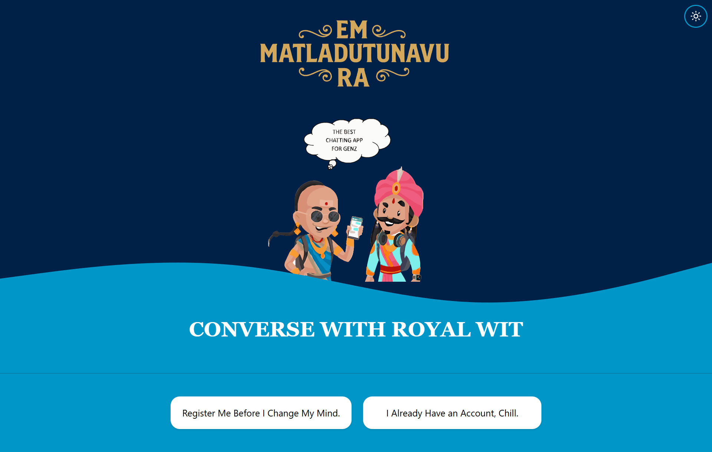
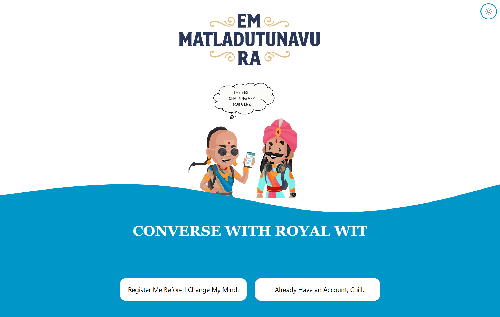
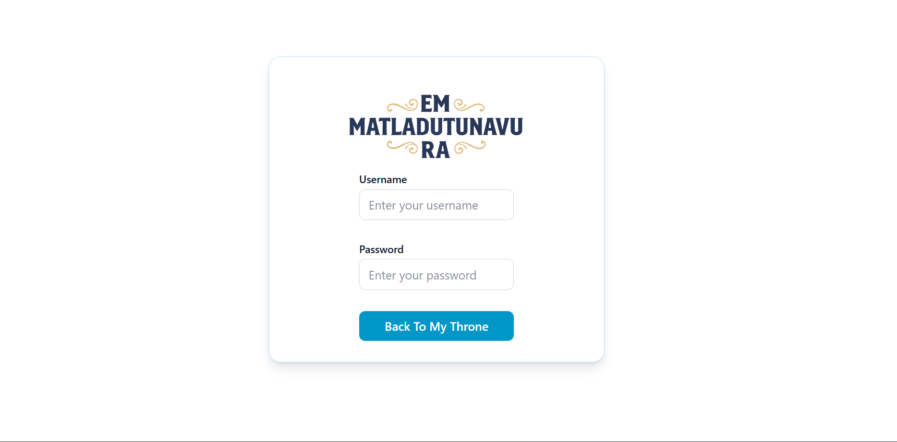
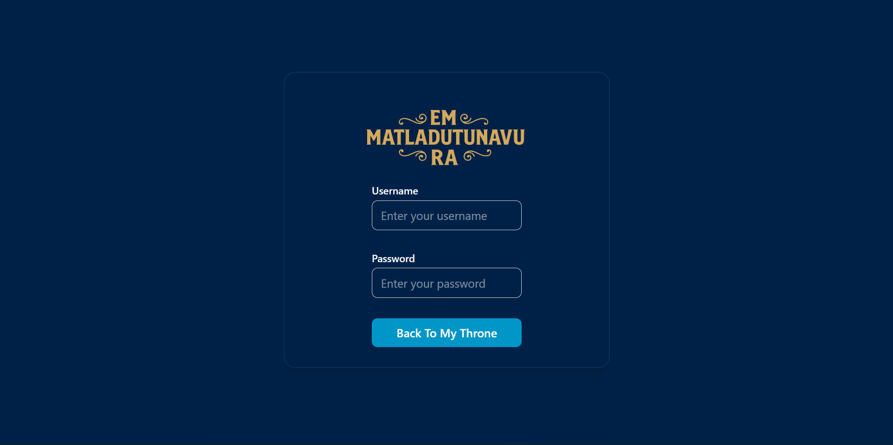
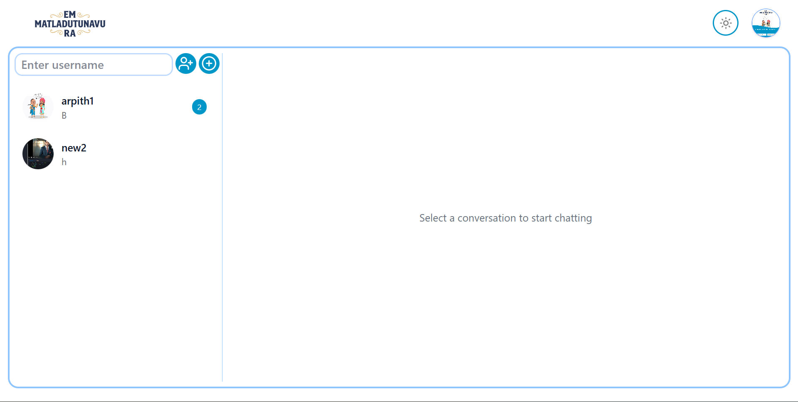
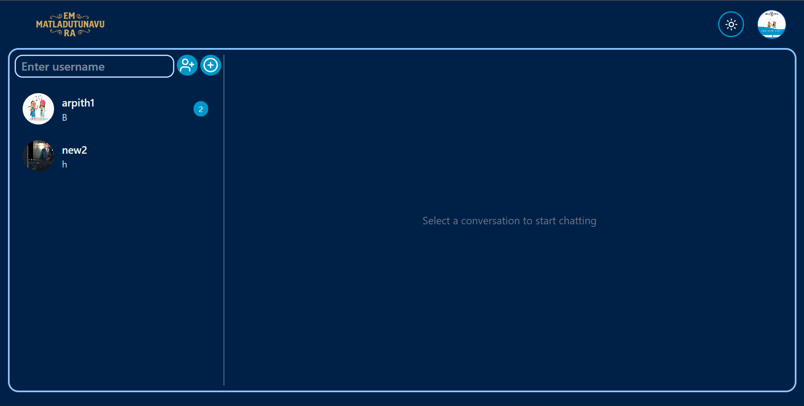
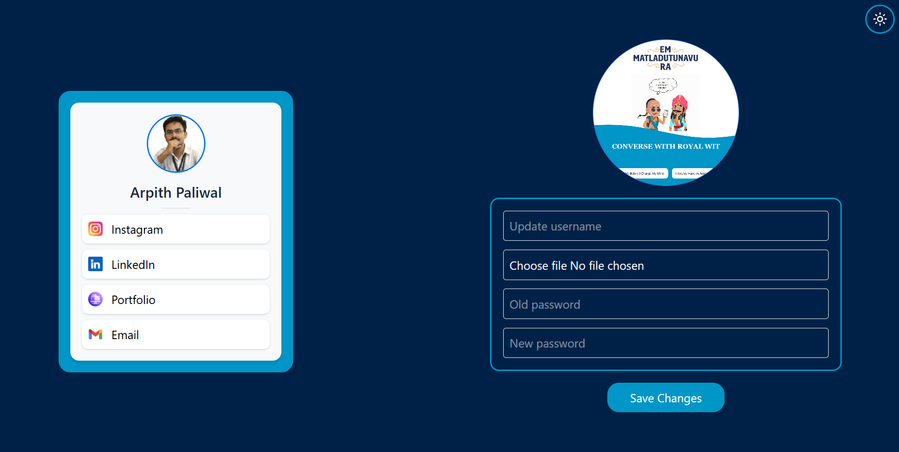

# 🚀 Project Title 
Em Matladutunavu Ra – Real-Time Chat Application

# 📌 Project Description 

Em Matladutunavu Ra is a full-stack real-time chat application built using modern web technologies to deliver ⚡ fast, 🔐 secure, and 📈 scalable messaging. The application supports real-time communication using WebSockets, 👤 user authentication, 🧑‍🤝‍🧑 private and group chats, 📎 media sharing, and 💾 persistent message storage.

This project focuses on 🏗️ production-grade backend architecture, 🔑 secure authentication, ⚙️ optimized socket handling, and 🎨 clean frontend user experience. It is designed to simulate real-world messaging platforms such as WhatsApp and Telegram while maintaining 🧩 modular and maintainable code structure.
## 🏗️ Architecture

The backend is built on a microservices architecture to ensure 📈 scalability and 🧩 separation of concerns.

*   👤 **User Service**: Manages all user-related operations, including authentication, profile management, and user data retrieval.
*   💬 **Chat Service**: Powers all real-time communication features, including conversations, messages, and WebSocket connections via Socket.IO.
*   📧 **Mail Service**: An asynchronous worker that handles sending emails, such as OTPs for user verification, by consuming messages from a RabbitMQ queue.

Communication between services is handled through REST APIs 🔁 for synchronous requests (e.g., Chat Service fetching user details from User Service) and RabbitMQ 🐇 for asynchronous event-driven tasks (e.g., User Service publishing a mail-sending event).

---

## 🛠️ Tech Stack

### 🔙 Backend
- **Language**: 🟦 TypeScript  
- **Runtime**: 🟢 Node.js  
- **Framework**: 🚀 Express.js  
- **Database**: 🍃 MongoDB with Mongoose ODM  
- **Real-time Communication**: 🔌 Socket.IO  
- **Caching & Rate Limiting**: ⚡ Redis  
- **Message Queue**: 🐇 RabbitMQ  
- **Object Storage**: ☁️ Cloudinary  
- **Authentication**: 🔐 JSON Web Tokens (JWT)  

### 🎨 Frontend
- **Framework**: ⚛️ React (with Vite)  
- **Language**: 🟦 TypeScript  
- **Styling**: 🎨 Tailwind CSS  
- **State Management**:  
    - **Global**: 🧰 Redux Toolkit  
    - **Server State**: 🔄 Tanstack React Query  
- **Routing**: 🧭 React Router  
- **Form Handling**: 📝 React Hook Form with Zod for validation  

## ✨ Features

### 💬 Core Chat Functionality
- ⚡ **Real-time Messaging**: Instantaneous message delivery in both private and group chats using Socket.IO.
- 👥 **Private & Group Conversations**: Users can create one-on-one chats or multi-user group conversations.
- 📎 **Media Attachments**: Support for sending and receiving image and video files, with cloud storage managed by Cloudinary.
- 📜 **Message History**: Infinite scrolling to progressively load older messages in a conversation.
- 🛠️ **Group Management**: Group creators can update group names and avatars. Users can leave groups.
- 🔔 **Unread Message Tracking**: Real-time counters for unread messages in the conversation list.
- ⚙️ **Optimistic UI Updates**: New messages appear instantly in the UI while being sent to the server in the background.

### 👤 User & Account Management
- 🔐 **Secure Authentication**: JWT-based authentication flow with access and refresh tokens stored in secure HTTP-only cookies.
- 📧 **OTP Verification**: New user registrations are verified via a one-time password sent to their email.
- ⏳ **Rate-Limited OTP**: Signup and OTP requests are rate-limited using Redis to prevent abuse.
- 🖊️ **Profile Customization**: Users can update their username and profile avatar.
- 🔑 **Password Management**: Securely update account passwords.

### 🎨 UI/UX
- 📱 **Responsive Design**: A seamless experience across desktop and mobile devices.
- 🌗 **Dark/Light Theme**: A theme toggle for user preference, with state persisted in local storage.
-   🔍 **Debounced User Search**: A performant user search feature that debounces input for efficient querying when creating new conversations.
- 🔔 **Toast Notifications**: Non-intrusive feedback for actions like successful logins or errors.
## Demo

https://em-matladutunavu-ra-frontend.vercel.app/


## Screenshots

## 📸 Screenshots

### 📸 Landing Page




### 🔐 Login Page




### 💬 Chat Interface




### 🧑‍🤝‍🧑 Dash Board



## Local Development Setup

### Prerequisites
- Node.js (v18 or higher)
- MongoDB
- Redis
- RabbitMQ
- A Cloudinary account

### 1. Backend Setup

The backend consists of three separate microservices that must be run concurrently.

For each service (`/backend/User`, `/backend/Chat`, `/backend/Mail`):

1.  **Navigate to the service directory:**
    ```bash
    cd backend/ServiceName
    ```

2.  **Install dependencies:**
    ```bash
    npm install
    ```

3.  **Create a `.env` file** and populate it with the necessary environment variables. Examples are provided below.

    **User & Chat Service `.env`:**
    ```env
    PORT=...
    MONGODB_URI=mongodb://localhost:27017
    ACCESS_TOKEN_SECRET=...
    REFRESH_TOKEN_SECRET=...
    ACCESS_TOKEN_EXPIRY=1h
    REFRESH_TOKEN_EXPIRY=7d
    CORS_ORIGIN=http://localhost:5173
    CLOUDINARY_CLOUD_NAME=...
    CLOUDINARY_API_KEY=...
    CLOUDINARY_API_SECRET=...
    REDIS_URL=redis://localhost:6379
    RABBITMQ_URL=amqp://localhost
    ```

    **Mail Service `.env`:**
    ```env
    RABBITMQ_URL=amqp://localhost
    USER=your-email@gmail.com
    PASS=your-gmail-app-password
    ```

4.  **Run the service in development mode:**
    ```bash
    npm run dev
    ```

### 2. Frontend Setup

1.  **Navigate to the frontend directory:**
    ```bash
    cd frontend
    ```

2.  **Install dependencies:**
    ```bash
    npm install
    ```

3.  **Create a `.env` file** at the root of the `/frontend` directory and add the base URLs for your backend services:
    ```env
    VITE_API_BASE=http://localhost:8000/api/v1
    VITE_API_BASE_CHAT=http://localhost:5000/api/v1
    VITE_API_BASE_CHAT_SOCKET=http://localhost:5000
    ```

4.  **Run the frontend development server:**
    ```bash
    npm run dev
    ```

The application should now be running on `http://localhost:5173`.
## Environment Variables

To run this project, you will need to add the following environment variables to your .env file

 **User & Chat Service `.env`:**

    
    PORT=...
    MONGODB_URI=mongodb://localhost:27017
    ACCESS_TOKEN_SECRET=...
    REFRESH_TOKEN_SECRET=...
    ACCESS_TOKEN_EXPIRY=1h
    REFRESH_TOKEN_EXPIRY=7d
    CORS_ORIGIN=http://localhost:5173
    CLOUDINARY_CLOUD_NAME=...
    CLOUDINARY_API_KEY=...
    CLOUDINARY_API_SECRET=...
    REDIS_URL=redis://localhost:6379
    RABBITMQ_URL=amqp://localhost


**Mail Service `.env`:**
    
    RABBITMQ_URL=amqp://localhost
    USER=your-email@gmail.com
    PASS=your-gmail-app-password
    

  **Run the service in development mode:**
    
    
    npm run dev
    
 **Create a `.env` file** at the root of the `/frontend` directory and add the base URLs for your backend services:

    
    VITE_API_BASE=http://localhost:8000/api/v1
    VITE_API_BASE_CHAT=http://localhost:5000/api/v1
    VITE_API_BASE_CHAT_SOCKET=http://localhost:5000
    ## 📁 Project Structure

```bash
backend/
├── Chat/                       # Chat microservice
│   └── src/
│       ├── clients/            # Inter-service API clients
│       ├── controllers/        # Request handlers
│       ├── db/                 # Database connection
│       ├── dtos/               # Request/Response Data Transfer Objects
│       ├── middlewares/        # Auth & upload middleware
│       ├── models/             # Mongoose models & interfaces
│       ├── repositories/       # Data access layer
│       ├── routes/             # Express route definitions
│       ├── services/           # Business logic layer
│       ├── sockets/            # Socket.IO server & events
│       ├── types/              # TypeScript global extensions
│       ├── utils/              # Shared helpers & utilities
│       ├── app.ts              # Express app configuration
│       └── index.ts            # Service entry point
│
├── Mail/                       # Mail microservice
│   └── src/
│       ├── rabbitmq/           # RabbitMQ consumers
│       └── index.ts            # Worker entry point
│
└── User/                       # User microservice
    └── src/
        ├── controllers/        # Auth & user controllers
        ├── db/                 # Database connection
        ├── dtos/               # Auth, signup, and response DTOs
        ├── middlewares/        # Auth & file middleware
        ├── models/             # User schema
        ├── rabbitmq/           # Mail event producers
        ├── redis/              # Cache & rate limiting services
        ├── repositories/       # Auth data access layer
        ├── routes/             # User routes
        ├── services/           # Auth business logic
        ├── types/              # TypeScript extensions
        ├── utils/              # Helpers & crypto utilities
        ├── app.ts              # Express app configuration
        └── index.ts            # Service entry point


frontend/
├── public/
└── src/
    ├── API/                    # API service wrappers
    ├── assets/                 # Images, icons, sounds
    ├── components/             # UI components
    ├── dto/                    # API response DTOs
    ├── hooks/                  # Custom React hooks
    ├── pages/                  # Application pages
    ├── providers/              # Context providers
    ├── redux/                  # Redux slices
    ├── routes/                 # Routing configuration
    ├── Services/               # Socket service
    ├── store/                  # Redux store
    ├── utils/                  # Helpers & UI utilities
    ├── App.tsx
    └── main.tsx
